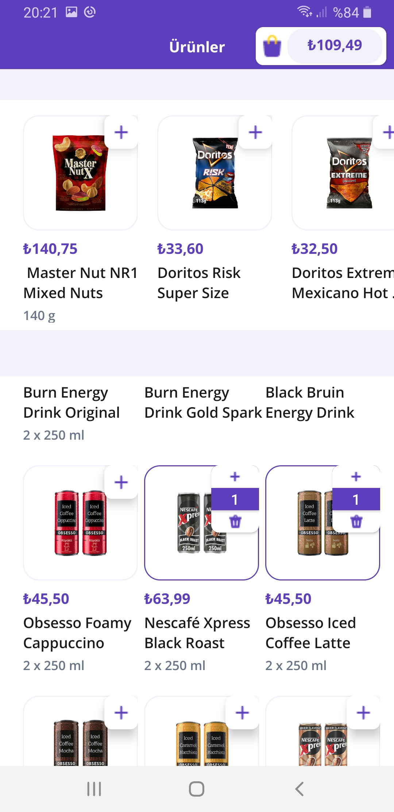
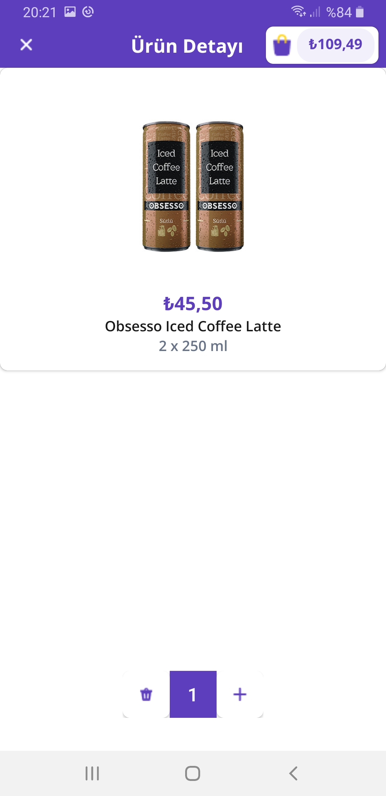
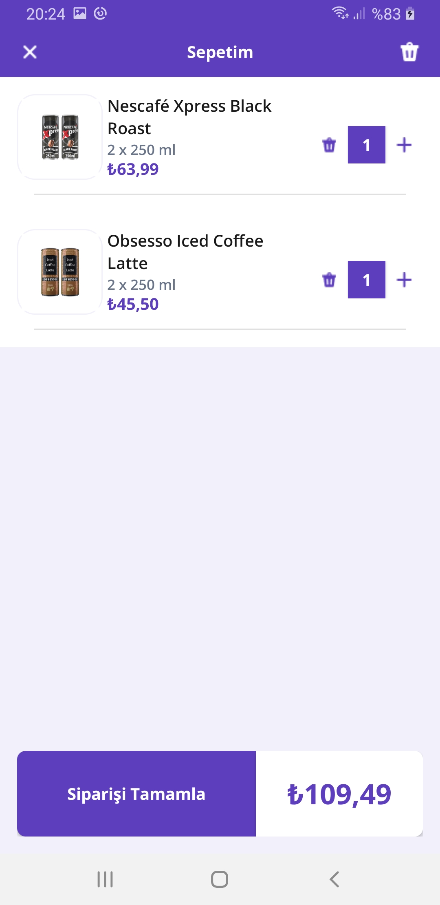
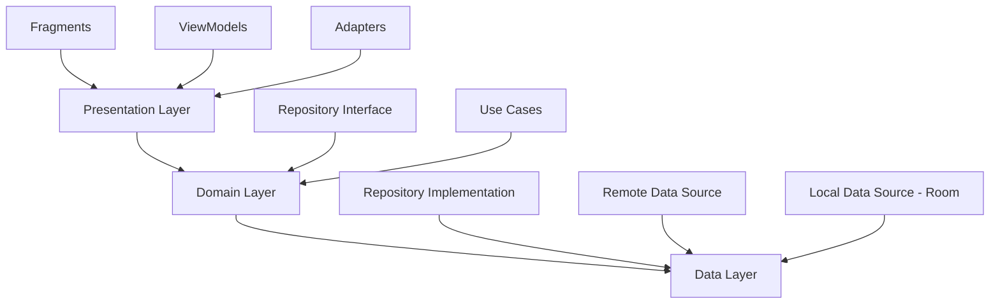

<div align="center">

# 🛒 Getir Final App

### Modern Android E-Commerce Application

[](https://kotlinlang.org)
[](https://www.android.com)
[](https://github.com/bymaskeli53/GetirFinalApp)

A fully-featured Android shopping application built with modern Android development tools and best practices. This project demonstrates clean architecture, MVVM pattern, and comprehensive use of Jetpack libraries.

[Features](#-features) • [Screenshots](#-screenshots) • [Tech Stack](#-tech-stack) • [Getting Started](#-getting-started) • [Architecture](#-architecture)

</div>

---

## 📱 Screenshots

<div align="center">

| Products List | Product Details | Shopping Basket |
|:---:|:---:|:---:|
|  |  |  |
| Browse through products with suggested items | View detailed product information | Manage your shopping cart |

</div>

---

## ✨ Features

### 🎯 Core Functionality

- **📦 Product Listing**
  - Grid layout displaying products (3 columns)
  - Horizontal scrollable suggested products carousel
  - Real-time loading with shimmer effect animations
  - Quick add-to-cart functionality

- **🔍 Product Details**
  - Comprehensive product information display
  - High-quality product images with transformations
  - Price and description information
  - Smooth navigation transitions

- **🛍️ Shopping Cart**
  - Add/remove items from basket
  - Real-time quantity management
  - Automatic total price calculation
  - Animated price updates in toolbar
  - Clear all items with confirmation dialog

- **💾 Data Persistence**
  - Local Room database storage
  - Cart items survive app restarts
  - Real-time Flow-based updates

- **🎨 Modern UI/UX**
  - Material Design 3 guidelines
  - Smooth animations and transitions
  - Responsive layouts for all screen sizes
  - Custom shimmer loading effects
  - Dark mode support

---

## 🛠️ Tech Stack

### Core Technologies

| Category | Technology |
|----------|------------|
| **Language** |  |
| **Min SDK** | API 24 (Android 7.0) |
| **Target SDK** | API 34 (Android 14) |
| **Build System** | Gradle (Kotlin DSL) |
| **Architecture** | MVVM + Clean Architecture |

### 📚 Libraries & Frameworks

#### Android Jetpack
```kotlin
• Core KTX 1.15.0              - Android core extensions
• AppCompat 1.7.0              - Backward compatibility
• ConstraintLayout 2.2.0        - Flexible UI layouts
• RecyclerView 1.3.2           - Efficient list displays
• Material Design 3            - Modern UI components
```

#### Architecture Components
```kotlin
• Navigation 2.7.7             - Fragment navigation with Safe Args
• ViewModel 2.8.7              - UI state management
• LiveData 2.8.7               - Observable data holder
• Room 2.6.1                   - SQLite database abstraction
```

#### Networking & Data
```kotlin
• Retrofit 2.11.0              - Type-safe HTTP client
• Gson                         - JSON serialization
• Coroutines 1.9.0             - Asynchronous programming
• Flow                         - Reactive data streams
```

#### Dependency Injection
```kotlin
• Dagger Hilt 2.52             - Compile-time DI framework
```

#### Image Loading
```kotlin
• Coil 2.6.0                   - Modern image loading library
```

#### UI Enhancements
```kotlin
• Facebook Shimmer 0.5.0       - Skeleton loading animations
```

#### Code Quality
```kotlin
• Detekt 1.23.5                - Static code analysis
• JUnit 4.13.2                 - Unit testing
• Espresso 3.6.1               - UI testing
```

---

## 🏗️ Architecture

This project follows **Clean Architecture** principles with **MVVM** pattern for a scalable and maintainable codebase.

### Architecture Layers



### 📂 Project Structure

```
com.example.getirfinalapp/
│
├── 📱 ui/                          # Presentation Layer
│   ├── activity/
│   │   └── MainActivity.kt        # Main container activity
│   ├── fragment/
│   │   ├── BaseFragment.kt        # Base fragment with view binding
│   │   ├── ListingFragment.kt     # Products listing screen
│   │   ├── DetailFragment.kt      # Product detail screen
│   │   └── BasketFragment.kt      # Shopping cart screen
│   └── viewmodel/
│       ├── ProductViewModel.kt    # Products state management
│       └── BasketViewModel.kt     # Basket state management
│
├── 📊 data/                        # Data Layer
│   ├── database/
│   │   ├── ProductDatabase.kt     # Room database
│   │   └── ProductDao.kt          # Data access object
│   ├── model/
│   │   ├── ProductModelItem.kt    # API response model
│   │   ├── GeneralProductItem.kt  # Database entity
│   │   └── SuggestedProductItem.kt
│   ├── repository/
│   │   └── ProductRepositoryImpl.kt
│   └── RemoteDataSource.kt        # API data source
│
├── 🌐 network/                     # Network Layer
│   ├── GetirApiService.kt         # Retrofit service interface
│   └── ApiResult.kt               # Sealed class for API responses
│
├── 💉 di/                          # Dependency Injection
│   ├── NetworkModule.kt           # Retrofit & API configuration
│   ├── DatabaseModule.kt          # Room database configuration
│   └── RepositoryModule.kt        # Repository bindings
│
├── 🎨 adapter/                     # RecyclerView Adapters
│   ├── BaseProductsAdapter.kt     # Generic base adapter
│   ├── ProductsAdapter.kt         # Products grid adapter
│   ├── SuggestedProductsAdapter.kt # Horizontal carousel
│   └── BasketAdapter.kt           # Shopping cart items
│
└── 🔧 util/                        # Utilities
    ├── PriceFormatter.kt          # Turkish price formatting
    ├── PriceAnimationHelper.kt    # Animated price transitions
    ├── ViewExt.kt                 # View extensions
    └── NumberExt.kt               # Number formatting extensions
```

---

## 🎯 Key Features Implementation

### State Management

**StateFlow for Products**
```kotlin
// Reactive data streams with Kotlin Flow
private val _products = MutableStateFlow<ApiResult<List<ProductModelItem>>>(ApiResult.Loading())
val products: StateFlow<ApiResult<List<ProductModelItem>>> = _products
```

**LiveData for Basket**
```kotlin
// Observable pattern for UI updates
private val _totalPrice = MutableLiveData<Double>()
val totalPrice: LiveData<Double> = _totalPrice
```

### Error Handling

```kotlin
sealed class ApiResult<out T> {
    data class Success<out T>(val data: T) : ApiResult<T>()
    data class Error(val message: String) : ApiResult<Nothing>()
    data class Loading<out T>(val data: T? = null) : ApiResult<T>()
    object NetworkError : ApiResult<Nothing>()
}
```

### Database Schema

**Room Database Tables**

| Product Table | Type | Description |
|--------------|------|-------------|
| `id` | Primary Key | Unique product identifier |
| `name` | String | Product name |
| `price` | Double | Product price |
| `imageURL` | String | Product image URL |
| `quantity` | Int | Items in basket |
| `priceText` | String | Formatted price text |
| `shortDescription` | String | Brief product description |

---

## 🚀 Getting Started

### Prerequisites

Before you begin, ensure you have the following installed:

- **Android Studio** Hedgehog | 2023.1.1 or later
- **JDK** 17 or higher
- **Gradle** 8.0+
- **Minimum SDK**: API 24 (Android 7.0)

### Installation

1. **Clone the repository**
   ```bash
   git clone https://github.com/bymaskeli53/GetirFinalApp.git
   cd GetirFinalApp
   ```

2. **Open in Android Studio**
   - Launch Android Studio
   - Select "Open an Existing Project"
   - Navigate to the cloned directory
   - Wait for Gradle sync to complete

3. **Build the project**
   ```bash
   ./gradlew build
   ```

4. **Run the app**
   - Connect an Android device or start an emulator
   - Click the "Run" button (▶️) in Android Studio
   - Or use command line:
   ```bash
   ./gradlew installDebug
   ```

### Configuration

No additional configuration needed! The app uses a mock API endpoint:
```
https://65c38b5339055e7482c12050.mockapi.io/
```

---

## 🌐 API Endpoints

| Method | Endpoint | Description |
|--------|----------|-------------|
| `GET` | `/api/products` | Fetch all products |
| `GET` | `/api/suggestedProducts` | Fetch suggested products |

### Sample Response

```json
{
  "id": "1",
  "name": "Product Name",
  "price": 19.99,
  "priceText": "₺19,99",
  "imageURL": "https://example.com/image.jpg",
  "shortDescription": "Product description"
}
```

---

## 🧪 Testing

Run unit tests:
```bash
./gradlew test
```

Run instrumented tests:
```bash
./gradlew connectedAndroidTest
```

Run code quality checks:
```bash
./gradlew detekt
```

---

## 🎨 UI/UX Highlights

### 🎭 Animations
- **Shimmer Effect**: Elegant loading states
- **Price Animations**: Smooth number transitions with bounce interpolator
- **Navigation Transitions**: Slide-in animations between screens
- **Color Feedback**: Visual confirmation for user actions

### 🎨 Design Elements
- **Material Design 3**: Modern, consistent UI components
- **Custom Toolbar**: Dynamic toolbar with real-time price updates
- **Grid Layout**: Optimized 3-column product grid
- **Circular Images**: Cropped product images for better visual appeal
- **Turkish Locale**: Proper formatting for Turkish currency (₺)

---

## 📦 Build Configuration

```groovy
android {
    compileSdk = 35
    minSdk = 24
    targetSdk = 34

    kotlinOptions {
        jvmTarget = "1.8"
    }

    buildFeatures {
        viewBinding = true
    }
}
```

---


## 📄 License

This project is licensed under the MIT License - see the [LICENSE](LICENSE) file for details.

---


<div align="center">

### ⭐ Star this repository if you found it helpful!

**Made with ❤️ and Kotlin**

</div>
